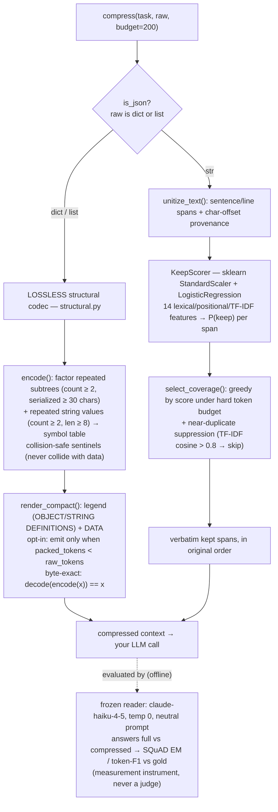

# Eat Tokens Wisely

A context-compression layer for LLMs and agents. It shrinks the context you send a model in one of two ways, chosen by input type:

- **Lossless structural codec** — for structured/repetitive input (JSON tool output, logs): factors repeated subtrees and string values into a symbol table. `decode(encode(x)) == x`, byte-exact. The compact form is read natively by the model.
- **Lossy extractive selector** — for prose (docs, search results, conversations, transcripts): a CPU keep-scorer picks the smallest set of *verbatim* source spans under a token budget. No text is generated, so nothing is fabricated.

There is **no LLM in the compression path** — it is scikit-learn plus string operations, deterministic, and runs with the model API key unset. An LLM (`claude-haiku-4-5`, temperature 0) is used only as a frozen *reader* to measure whether the compressed context still yields the right answer, scored against gold labels with exact-match / token-F1 — never an LLM judge.

> **Interactive architecture explainer:** run the server and open **`/architecture`** (or the file [`web/architecture.html`](web/architecture.html)) — a one-page visual walkthrough of the design, the results with confidence intervals, and the two null results.

---

## Architecture



The two stages are independent: the lossless codec is pure data transformation; the extractive selector is a learned ranker plus a budgeted, redundancy-aware selection. They never run on the same input.

---

## Usage

One function, one line before your model call. `raw` is a `str` (prose → extractive) or a `dict`/`list` (JSON → lossless codec, auto-selected):

```python
from suffix.pipeline import compress

res = compress(task=user_question, raw=tool_output_or_docs, budget=240)
context = res["compressed_text"]          # verbatim spans (prose) or compact codec form (JSON)
# res["reduction_pct"], res["compression_x"], res["mode"] ("lossy" | "lossless")

client.messages.create(model="claude-...", messages=[
    {"role": "user", "content": f"{context}\n\n{user_question}"}])
```

JSON-only callers can use the codec directly:

```python
from suffix.structural import render_compact, structural_report
rep = structural_report(obj)        # {raw_tokens, packed_tokens, saved_tokens, ratio, n_refs,
                                    #  n_subtree_refs, n_string_refs, lossless_verified, beneficial}
if rep["beneficial"]:               # opt-in: declines when the ref table costs more than it saves
    context = render_compact(obj)   # decode() reconstructs the original object exactly
```

---

## How it works

### Lossless structural codec (`suffix/structural.py`)
`encode(obj)` runs two passes over the JSON:
1. **Subtree dedup.** Canonicalize every dict/list (`json.dumps(sort_keys=True, separators=(",",":"))`), count occurrences, and replace any subtree that appears `≥ _MIN_COUNT` (2) times with a serialized form `≥ _MIN_SUB_LEN` (30) chars by a one-key reference `{subkey: "T<i>"}`. The whole object is never replaced by a ref.
2. **String-value dedup.** Replace any string value appearing `≥ 2` times with length `≥ _MIN_LEN` (8) by a short symbol (e.g. `@R0`).

Reference tokens are **collision-safe**: the subtree key is chosen as the first of `("§SUB§","@@SUB@@","<<SUBREF>>","~~SUBREF~~")` not present as any key in the object (counter-extended fallback otherwise); the string sentinel is chosen so it is a substring of no value. `decode(enc)` inverts both passes; `structural_report()` computes `verified = decode(encode(obj)) == obj` at runtime and asserts it. `render_compact(obj)` emits an LLM-readable legend (`OBJECT DEFINITIONS` / `STRING DEFINITIONS`) followed by a `DATA:` block. `beneficial = packed_tokens < raw_tokens` — the codec is **opt-in** because on low-repetition payloads the legend can exceed the savings.

The lossless guarantee is `decode(encode(obj)) == obj` (deep object equality). `tests/test_structural.py` asserts it byte-for-byte over ~10 payloads including unicode, empty containers, and **adversarial inputs that contain every sentinel token** (forcing the collision-safe fallbacks).

### Lossy extractive selector (`suffix/pipeline.py`, `scorer.py`, `coverage.py`, `features.py`)
1. **Unitize** (`unitize_text`): split prose into sentence/line spans with char-offset provenance.
2. **Score** (`KeepScorer`): an sklearn `StandardScaler + LogisticRegression(C=1.0, max_iter=2000, class_weight="balanced")` over **14 features** per span (`suffix/features.py`): per-example TF-IDF cosine to the query, content-word Jaccard/overlap, number/capitalized-token overlap, title-in-query, paragraph/sentence position, length, entity density. The scorer was fit on HotpotQA human `supporting_facts` labels (`u["is_gold"]`); at inference it sees only `(question, span)` — no gold, no leakage. Output is `P(keep)` per span.
3. **Select** (`select_coverage`): greedy by descending score, admit a span if it fits the remaining **token budget** and its max TF-IDF cosine to any already-kept span is `≤ τ` (`_TAU = 0.8`); near-duplicates above 0.8 are skipped. Selected spans are re-emitted in original `(para, sent)` order. With `τ ≥ 1.0` this is exactly learned-scorer top-k.

Output is a **verbatim subsequence** of the source: every kept span is an exact substring of the input; the only added text is synthetic section headers. `tests/test_extractive.py` asserts this by string-containment.

**Coverage-confidence + safe fallback.** Every lossy result reports `coverage` — the share of the question's key terms present in the kept spans — plus `confident` and `fallback_recommended`. This turns a silent drop into a signal: when the answer's terms aren't covered, the caller knows to send full context. With `compress(..., safe=True)`, the budget **auto-widens** until those terms are covered rather than dropping them (unit-tested in `tests/test_extractive.py`).

**Optional — semantic reranking (`suffix/semantic.py`).** The learned scorer ranks mostly by *lexical* overlap, so it can miss an answer phrased differently from the question (zero shared words). An optional, **generation-free** embedding signal (a small ONNX model via `fastembed`, no LLM) closes that gap: `compress(task, raw, budget, semantic=True)` blends embedding-cosine into the score. It is **off by default and a no-op if no backend is installed** (the pipeline is unchanged). Demonstrated in `scripts/semantic_demo.py`: on a constructed lexical-gap case the lexical scorer ranks the answer #3 and drops it, while the semantic blend ranks it #1 and keeps it — despite zero shared words. Enable with `pip install fastembed`. Both toggles are live in the demo's compressor.

### Measurement (`suffix/llm.py`, `suffix/metrics.py`)
The reader is `claude-haiku-4-5`, `max_tokens=32`, `temperature=0`, with a fixed neutral system prompt (*"answer from the provided context only … shortest exact answer … no explanation"*), identical for the full and compressed arms; the gold answer is never in the prompt. Scoring is `squad_em` (normalized exact match) and `squad_f1` (token-level F1) — pure string comparison, no model in the loop.

---

## Results

### Benchmark setup
- **Datasets.** HotpotQA distractor (intrinsic n = 300 / downstream ablation n = 150); cross-task on SQuAD, CoQA, 2WikiMultiHopQA, NarrativeQA (n = 60–100); the lossless codec on 12 generated GitHub-issue tool-output bundles (n = 60 Q/A).
- **Reader.** `claude-haiku-4-5`, `temperature=0`, `max_tokens=32`, one neutral prompt held identical across the full and compressed arms — a measurement instrument, never a judge.
- **Metrics.** SQuAD-style EM and token-F1 (`squad_em` / `squad_f1`); supporting-fact precision/recall/F1 for the intrinsic (API-free) arm. No LLM judge anywhere.
- **Confidence intervals.** Paired bootstrap on per-example F1 differences (n = 2000 resamples, seed 0); "clears 0" means the 95% CI excludes zero.
- **Baselines** (same harness, same budget): full context (ceiling), random (floor), TF-IDF top-k, **BM25 top-k** (Okapi, k1 = 1.5, b = 0.75), no-coverage (scorer top-k, dedup off), no-scorer (uniform relevance).
- **Tokenizer.** `tiktoken cl100k_base` as a stable ratio ruler (undercounts Claude ~15–20%); **ratios are the reported metric**, absolute counts approximate.

### Extractive compression vs. baselines (answer F1 @ ~237 tokens)
| condition | tokens | EM | F1 | retained |
|---|--:|--:|--:|--:|
| full context | 1250 | 0.647 | **0.790** | 100% |
| **ours** (human-gold scorer) | 237 | 0.487 | 0.598 | **76%** |
| BM25 top-k | 237 | 0.493 | 0.608 | 77% |
| query-agnostic importance (LLMLingua-2-style) | 237 | 0.220 | 0.276 | 35% |
| random | 117 | 0.167 | 0.208 | 26% |

**5.27× fewer tokens at 76% of full-context F1.** Honest reading: on HotpotQA our learned scorer **≈ BM25** at matched budget (`bestCA − bm25@240 = −0.011`, CI `[−0.070, +0.050]`, includes 0). Compression is lossy and **does cost F1 vs full context** (`−0.192`, CI `[−0.261, −0.126]`).

### The one CI-backed competitive result
Query-conditioning beats the query-agnostic, delete-only paradigm: with selector and budget fixed and only the *training label* changed, query-conditioned − query-agnostic = **+0.285 F1**, CI `[+0.202, +0.371]`, **excludes 0** (`C_minus_B@240`). Learned keep-scorer AUC = **0.879** vs BM25 0.820 / TF-IDF 0.799.

### Lossless codec, read natively (`data/structural_qa.json`)
12 GitHub-issue tool-output bundles × 5 guess-resistant questions (n = 60), reader on full pretty JSON vs the compact form:

| form | tokens | EM | F1 |
|---|--:|--:|--:|
| full (pretty JSON) | 4296 | 1.00 | 1.00 |
| compact (codec) | 2217 | 1.00 | 1.00 |

**48.4% fewer tokens vs pretty / 21.2% vs minified** (codec contribution net of whitespace), **identical answers**, byte-exact round-trip.

### Cross-task generalization (scorer used unchanged)
| dataset | full F1 | ours@240 | BM25@240 | retained |
|---|--:|--:|--:|--:|
| SQuAD | 0.834 | 0.854 | 0.817 | ~102% |
| CoQA (conversations) | 0.804 | 0.800 | 0.757 | ~100% |
| 2WikiMultiHop | 0.542 | 0.309 | **0.349** | ~57% |
| NarrativeQA | 0.649 | 0.386 | **0.567** | ~59% |

Mixed, reported honestly: the framework always beats random and recovers most of full-context F1 on SQuAD/CoQA, but on out-of-domain multi-hop/long-narrative prose the **learned scorer transfers poorly and BM25 wins** — use BM25 as the scorer cross-domain.

### Redundancy stress-test (`data/redundancy.json`, no API)
Injecting up to 12 near-duplicate copies of a distractor at budget 80: our gold-fact recall holds (0.495 → 0.483) while plain top-k collapses (0.496 → 0.365). The near-duplicate suppressor is the difference, and only matters on duplicate-heavy retrieval (it is inactive on native HotpotQA distractors).

### Economics
At the shipped operating point (1250 → 237 tokens, 5.27×), ~1013 tokens saved per query → **~$1.0k / $3.0k / $5.1k saved per 1M queries** at Haiku / Sonnet / Opus input prices (`suffix/economics.py`). Conservative, since `cl100k` undercounts Claude tokens.

### Two reported null results
We pre-registered two ideas and **both failed their gates** — the simple pipeline (human-gold scorer + coverage at fixed budget) is what works:
- **Reader-grounded labels** (train on leave-one-out answer impact) do **not** beat human labels: `C − A@240 = −0.036`, CI `[−0.081, +0.012]` (and significantly *worse* without dedup).
- **Learned variable-rate budgeting** does **not** beat a fixed budget: deltas at 80/120/180 tokens all have CIs straddling 0. An oracle (answer-cheating) frontier showed large headroom (+0.27 F1), so the headroom is real but unrealizable without the answer.

---

## Repo map

```
suffix/                 core library (CPU, no LLM in the compression path)
  pipeline.py           compress(task, raw, budget) — type-routes JSON↔prose; live entrypoint
  structural.py         lossless codec: encode/decode/render_compact/structural_report
  scorer.py             KeepScorer (sklearn LogReg over features.py)
  features.py           14 per-span features (FEATURE_NAMES)
  coverage.py           select_coverage — budgeted greedy + near-dup suppression (τ=0.8)
  compose.py            render kept spans verbatim under section headers
  baselines.py          full / random / tfidf_topk / bm25_topk / no-coverage / no-scorer ablations
  metrics.py            squad_em, squad_f1, supporting_fact_prf  (string metrics, no judge)
  llm.py                read_answer — frozen reader (claude-haiku-4-5, temp 0)
  economics.py          token→dollar savings by model tier
  text_utils.py         deterministic tokenization / anchors / normalize_answer
  tokens.py             count_tokens (tiktoken cl100k_base ruler)
server/app.py           FastAPI: / /architecture /api/results /api/prove /api/usecase[s]
                        /api/compress /api/hero /api/tts  (global JSON error handler)
web/                    index.html (dashboard) · architecture.html (explainer)
scripts/                build_all.sh + data builders; mcp_probe.py / mcp_demo.py (real MCP clients)
tests/                  test_structural · test_extractive · test_coverage
data/                   precomputed artifacts the server reads
```

### HTTP endpoints (`server/app.py`)
| route | does |
|---|---|
| `GET /` · `GET /architecture` | dashboard / architecture explainer |
| `GET /api/compress` *(POST)* | live CPU compression of pasted text/JSON; returns the full `compress()` dict |
| `GET /api/prove?i&budget` | live: reader answers full vs compressed on a held-out HotpotQA example, scored vs gold |
| `GET /api/usecase?id&customq` | runs one scenario live (lossy/lossless/voice/MCP); `customq` lets a user swap the question |
| `GET /api/usecases` | scenario list (prose, JSON tool output, logs, voice, real-MCP) |
| `GET /api/results` | precomputed benchmark JSON (Pareto, ablation, cross-task, structural, economics) |
| `GET /api/tts` | Deepgram TTS for the voice scenario |

### Real MCP integration (`scripts/mcp_demo.py`)
A minimal stdio JSON-RPC client (`scripts/mcp_probe.py`, no SDK) drives **five real MCP servers**: `@upstash/context7-mcp`, `@perplexity-ai/mcp-server`, `mcp-server-sqlite`, `@modelcontextprotocol/server-filesystem`, `mcp-server-git`. Their genuine tool output is compressed mode-appropriately — Context7 docs and Perplexity search via the extractive selector (~67% / ~81% fewer tokens, answer preserved by agreement with the full-context answer); SQLite rows via the lossless codec; filesystem/git are included to show the codec **declining** on low-redundancy output. Live calls happen at build time; the server replays the cached results.

---

## Run it

The demo reads small precomputed artifacts in `data/` and runs immediately:

```bash
pip install -r requirements.txt              # scikit-learn pinned ==1.9.0 (matches the pickled keep_scorer.joblib)
python -m uvicorn server.app:app --port 8000 # open http://127.0.0.1:8000
```

Live answers (`/api/prove`, `/api/usecase`) need `ANTHROPIC_API_KEY` in `.env` (and `DEEPGRAM_API_KEY` for voice). Compression itself needs no key.

**Verify the lossless guarantee with no API key:**
```bash
python -m pytest tests/ -q     # byte-exact round-trip (incl. adversarial sentinel inputs), verbatim spans, diversity
python -c "import json,sys; sys.path.insert(0,'.'); from suffix.structural import encode,decode; \
o=json.load(open('data/usecases.json'))[3]['json']; print('byte-exact:', decode(encode(o))==o)"
```

Rebuild every artifact from scratch (`[KEY]` steps call the APIs):
```bash
bash scripts/build_all.sh   # prepare_data → train_scorer → run_eval → run_ablation → run_redundancy
                            # → crosstask → make_usecases → make_voice → mcp_demo
```

---

## Methodology notes & limitations
- **Tokenizer.** All counts use `tiktoken cl100k_base` (GPT-4) as a stable ratio ruler; it is not Claude's tokenizer. Ratios are the reported metric; absolute counts are approximate.
- **In-domain, the learned scorer ≈ BM25.** The defensible competitive result is over the query-agnostic paradigm (+0.29 F1, CI clears 0), not over BM25. Cross-domain, prefer BM25 as the scorer.
- **Lossy ≠ lossless on QA.** Extractive compression costs F1 versus full context on QA (CI excludes 0). Only the structural JSON codec is byte-exact / EM-preserving.
- **Two headline hypotheses are null** (reader-grounded labels, learned variable-rate) — reported, not hidden.
- **Structural QA** is a small constructed test (12 bundles, n = 60).

## Foundations & related work
We use the datasets and the BM25 baseline directly, and benchmark against the query-agnostic compression paradigm. How our design relates to prior work:

**Context compression**
- **LLMLingua-2** — Pan et al., *Data Distillation for Efficient and Faithful Task-Agnostic Prompt Compression*, Findings of ACL 2024 ([arXiv:2403.12968](https://arxiv.org/abs/2403.12968)). The query-agnostic, distillation-based token-classification paradigm; our `B` ablation represents this approach, which our query-conditioned selector beats by +0.29 F1 (CI clears 0). See also LLMLingua (Jiang et al., EMNLP 2023).
- **RECOMP** — Xu, Shi & Choi, *Improving Retrieval-Augmented LMs with Context Compression and Selective Augmentation*, ICLR 2024 ([arXiv:2310.04408](https://arxiv.org/abs/2310.04408)). Extractive + abstractive compression for RAG.
- **FILCO** — Wang, Araki, Jiang, Parvez & Neubig, *Learning to Filter Context for Retrieval-Augmented Generation*, 2023 ([arXiv:2311.08377](https://arxiv.org/abs/2311.08377)). Learned context filtering on lexical/information-theoretic utility — closest to our reader-grounded-label experiment, which we report as a **null result**.

**Selection & retrieval**
- **BM25** — Robertson & Zaragoza, *The Probabilistic Relevance Framework: BM25 and Beyond*, 2009 — our lexical baseline.
- **MMR** (Carbonell & Goldstein, SIGIR 1998) and **submodular selection** (Lin & Bilmes, ACL 2011) — diversity-aware selection. Our near-duplicate suppression is a restricted form; we deliberately avoid a general MMR penalty, which we measured to hurt a second supporting fact that shared an entity with the first.

**Datasets & protocol**
- HotpotQA (Yang et al., 2018), SQuAD (Rajpurkar et al., 2016), CoQA (Reddy et al., 2019), 2WikiMultiHopQA (Ho et al., 2020), NarrativeQA (Kočiský et al., 2018).
- Model Context Protocol (Anthropic, 2024) — Context7, Perplexity, SQLite, filesystem, and git servers.

## Built with
Python · scikit-learn · NumPy/SciPy · tiktoken · FastAPI/uvicorn · Anthropic Claude (Haiku reader) · Deepgram · Model Context Protocol (Context7, Perplexity, SQLite, filesystem, git)
